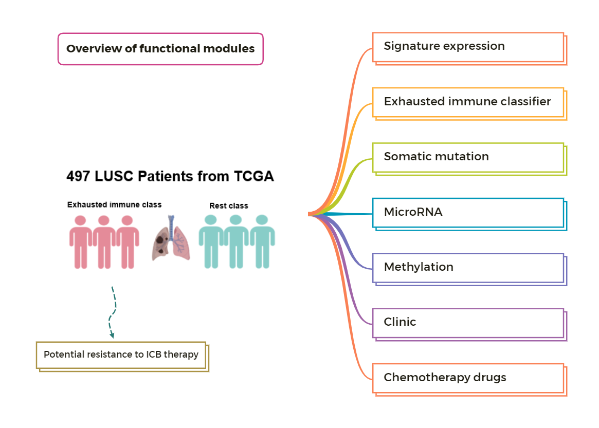

## Tex: multi-omic association analysis platform for exploring potential mechanism of immunotherapy resistance in LUSC. 



## Overview

The multi-omic analysis platform of *Tex* is an interactive web portal that provides multiple analysis modules to visualize and explore  potential mechanism of immunotherapy resistance in LUSC. The app is deployed at http://lilab2.sysu.edu.cn/tex & http://liwzlab.cn/tex for online use. 


**Tex** is idle until you activate it by accessing the [URL](http://lilab2.sysu.edu.cn/tex). So it may take some time to load for the first time. Once it was activated, **Tex** could be used smoothly and easily.

The portal is built entirely in **R** and **Shiny** using the **RStudio** development environment.

## Install

### Requirements

* R: https://www.r-project.org/ v4.1.1+
* RStudio: https://rstudio.com/products/rstudio/download
* Shiny Server: https://rstudio.com/products/shiny/download-server (only required for deploying **Tex** on web linux server)

### Initialize app

#### To run the app locally:

1. Clone this repository

```
git clone https://github.com/Lilab-SYSU/LUSC_Tex.git
```

> The repository is large so it may need some time to finish it.

2. Open `server.R` in Rstudio

3. Install packages. In the RStudio console, run:

```
# try an http CRAN (Bioc) mirror if https CRAN (Bioc) mirror doesn't work
# First install Bioconductor
if (!requireNamespace("BiocManager", quietly = TRUE))
    install.packages("BiocManager")
BiocManager::install(version = "3.14")

BiocManager::install("ComplexHeatmap",update = F)
BiocManager::install("clusterProfiler",update = F)

BiocManager::install("shiny",update = F)
BiocManager::install("shinythemes",update = F)
BiocManager::install("shinycssloaders",update = F)
BiocManager::install("shinydisconnect",update = F)

BiocManager::install("ggplot2",update = F)
BiocManager::install("DT",update = F)
BiocManager::install("plotly",update = F)
BiocManager::install("recharts",update = F)
BiocManager::install("ggsci",update = F)
BiocManager::install("ggsignif",update = F)
BiocManager::install("survival",update = F)
BiocManager::install("survminer",update = F)
BiocManager::install("pRRophetic",update = F)
BiocManager::install("drugTargetInteractions",update = F)
BiocManager::install("maftools",update = F)
BiocManager::install("ggpubr",update = F)
BiocManager::install("shinyWidgets",update = F)

## Install pRRophetic packages
### Download pRRophetic in Linux
wget -O pRRophetic_0.5.tar.gz  https://osf.io/dwzce/?action=download

### Install from local the package
BiocManager::install(c('sva', 'car', 'genefilter', 'preprocessCore', 'ridge'))
install.packages("pRRophetic_0.5.tar.gz", repos = NULL, dependencies = TRUE)
```

> This may take some time to complete - walk away from your computer, rest your eyes, and catch up on those stretching exercises you are meant to be doing :)

4. Start tha app by running

```
shiny::runApp(launch.browser = TRUE)
```

#### Deploy Tex on web Linux server

1. Clone/Upload this repository into /srv/shiny-server

```
$ cd /srv/shiny-server
git clone https://github.com/Lilab-SYSU/LUSC_Tex.git
mv LUSC_Tex Tex
# Or clone it locally and upload the directory to /srv/shiny-server using scp or other tools 
```

2. Configure Shiny Server (/etc/shiny-server/shiny-server.conf)

```
# Instruct Shiny Server to run applications as the user "shiny"
preserve_logs true;
sanitize_errors false;
run_as shiny;

# Define a server that listens on port 3838
server {
  listen 3838;

  # Define a location at the base URL
  location / {

    # Host the directory of Shiny Apps stored in this directory
    site_dir /srv/shiny-server;

    # Log all Shiny output to files in this directory
    log_dir /var/log/shiny-server;

    # When a user visits the base URL rather than a particular application,
    # an index of the applications available in this directory will be shown.
    directory_index on;
  }
}
```

3. Change the owner of the **Tex** directory

```
$ chown -R shiny /srv/shiny-server/Tex  
```

4. Start Shiny-Server

```
$ start shiny-server
```

